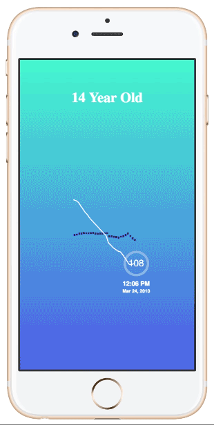
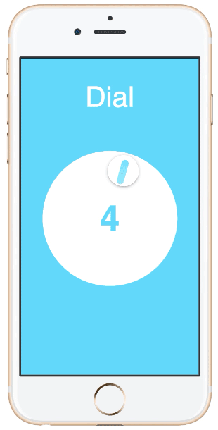
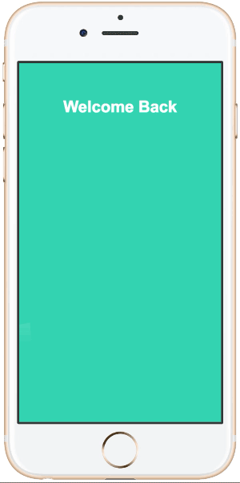
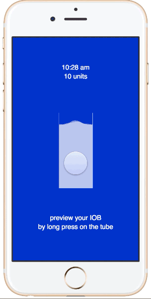
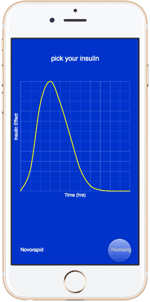
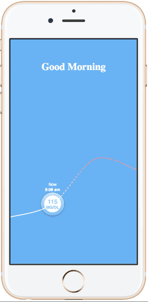
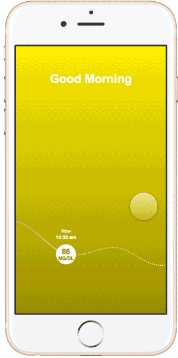

# FramerJS-Examples
A collection of prototypes using FramerJS

### bg-plot-over-time

`Visualizing a 14-year-old girl's glucose data using a line graph overtime`

### dial-button

`Simulating a circular dial button with rotating interaction`

### faces

`Play with BodyMovin AfterEffects Plugin, it includes a typewriter animation effect`

### firebase+iOSkits

`Play with firebase to sync data across different applications and testing iOS kits module`

### gradient-background

`Using gradient as background layer`

### gradient-fill-line-chart

`Drawing a line chart with gradient fill`

### iob-preview-p5

`Interaction study, Long Press on the water tub to preview Insulin on board number`

### line-chart-transition

`Animating line segments from one line graph to another line graph`

### scroll-dot-on-line-graph

`drag the dot along a line graph`

### scroll-line-changing-dot

`scroll the line horizontally with updating dot`

